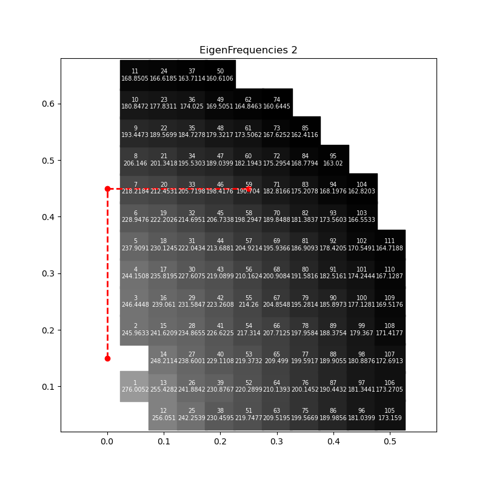

# Eigenmode Map for Industrial Robot Manipulator

## Pre-Requisites

* Linux Desktop (Recommended Ubuntu 18.04 or 20.04)
* [CalculiX (ccx,cgx)](http://www.calculix.de/)
* [CalculiX Launcher (with unical)](http://www.calculixforwin.com/)
* [Salome Platform](https://www.salome-platform.org/)
* [Julia Lang (with PyPlot)](https://julialang.org/)

## Concept

* [Milling accuracy improvement of a 6-axis industrial robot through dynamic analysis, PETER ERIKSSON, KTH, 2019](http://www.diva-portal.org/smash/get/diva2:1307667/FULLTEXT01.pdf) : 34 page, Pose dependent eigenfrequencies
* The Eigenmode of industrial robots depends on their posture.  Therefore, within the working range, it is recommended to calculate the eigenfrequency for all postures to determine their distribution.  Because manual analysis of all cases is inefficient, I have implemented automated methods.
  All the tools used for this are FOSS.

## Recipe

### 1. 3D Model


* Ref files : [robot.FCStd (FreeCAD 0.19)](robot.FCStd), [robot.stp (STEP AP214)](robot.stp)
* Default Orientation : Front : +x axis, Upper " +z axis
* Default Posture : "ㄱ"
* No interferences between parts, but 2 Contacts on joint 2,3
* Output `robot.stp`

### 2. Mesh


* Ref files : [robot.hdf (Salome 9.4)](robot.hdf), [robot.py (Modified python script after Dumped)](robot.py), [robot.unv (unv mesh)](robot.unv)

* Read `robot.stp`
* Make 3 sub-meshes by Salome
* Make 4 surfaces for 2 contact pairs by Salome
* Make 1 node set for ground supporting
* Dump to python
* Output  `robot.py`, `robot.unv`

### 3. Make Surface Groups

* Read  and Convert `robot.unv` into CalculiX Launcher (CL34)


* `Generate file for ccx` by CCX WIZARD in CalculiX Launcher


* Output `Allinone.inp` includes `*SURFACE` cards


* Make distributed surface group files (`*.sur`) by text editor

  - [L1_MASTER.sur](L1_MASTER.sur)
  - [L2_SLAVE.sur](L2_SLAVE.sur)
  - [L2_MASTER.sur](L2_MASTER.sur)
  - [L3_SLAVE.sur](L3_SLAVE.sur)

### 4. Edit python script

* Ref files :  [robot.py (Modified python script after Dumped)](robot.py), 
* Edit `robot.py` for `eigen.jl` carefully

```python
## Key Points

...
# Path setting
sys.path.insert(0, r'./')
...
# Import STEP File
robot = geompy.ImportSTEP("../robot.stp", False, True)
...
# Rotate by parameters
robot_1.RotateObject( L2_1, SMESH.AxisStruct( J2X, 0, J2Z, 0, 1, 0 ), J2_ANGLE, 0 )
robot_1.RotateObject( L3_1, SMESH.AxisStruct( J2X, 0, J2Z, 0, 1, 0 ), J2_ANGLE, 0 )
robot_1.RotateObject( L3_1, SMESH.AxisStruct( J3X, 0, J3Z, 0, 1, 0 ), J3_ANGLE, 0 )
...
# Export UNV File
  robot_1.ExportUNV( r'robot.unv' )
...
# Kill Salome
# https://www.salome-platform.org/forum/forum_10/645560298#457218771
import os
from killSalomeWithPort import killMyPort
killMyPort(os.getenv('NSPORT'))
```

### 5. Scripts

* [robot.sh](robot.sh) : FEA
* [eigen.jl](eigen.jl) : IK
* [EigenData_Plot.jl](EigenData_Plot.jl) : Plot

### 6. Run

* In this example, when calculating using an old-fashioned notebook PC (CPU Intel old dual core 1.5GHz, RAM 4MB), 1,357 cases were generated and the calculation took about a day to complete.

```bash
julia eigen.jl
julia EigenData_Plot.jl
```

### 7. Result

* Pose by IK is not yet perfect.
* Eigenfrequency Maps of Mode 1~4 on 1st quadrant space





* Visualization by cgx


### Good luck!